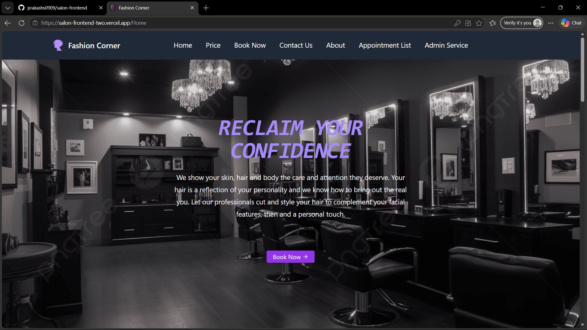
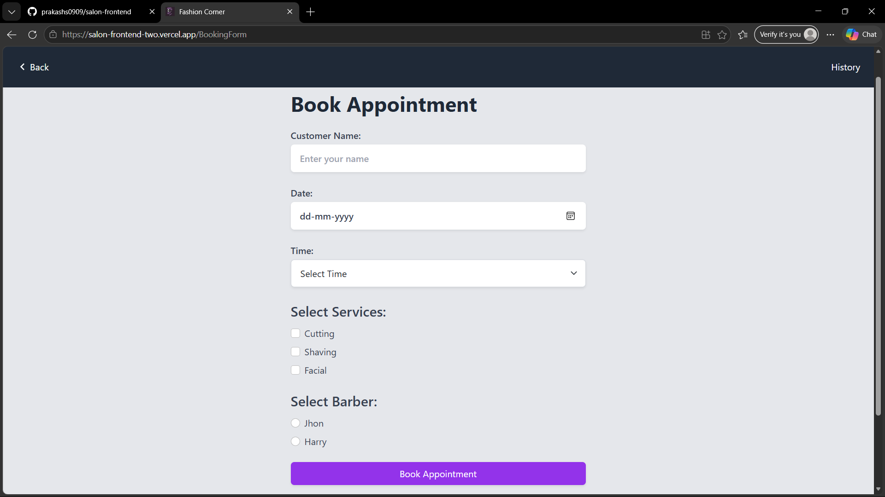
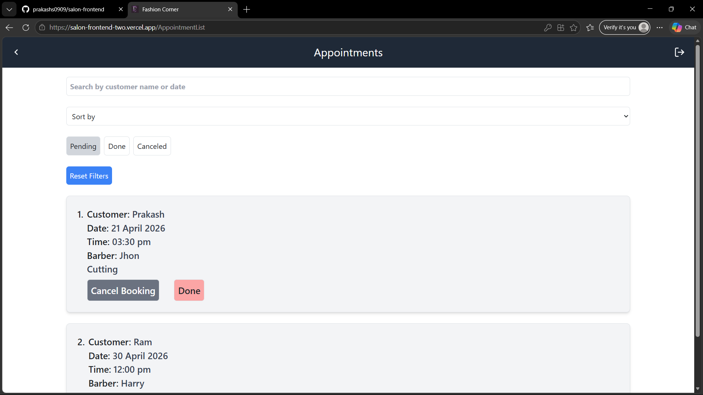

# Salon Booking System 💇‍♂️

## 🚀 Features

* User authentication (JWT)
* Book appointments
* Admin dashboard
* Responsive UI

## 🛠 Tech Stack

React, Node.js, Express, MongoDB, Tailwind CSS

## 📸 Screenshots

<p align="center">
  
  
  
</p>

## 🔗 Live Demo

https://salon-frontend-two.vercel.app/

## Setup

Clone both folder salon-frontend and salon-backend in same folder
```bash id="run01"
git clone https://github.com/prakashs0909/salon-frontend.git
git clone https://github.com/prakashs0909/salon-backend.git
```

## ⚙️ Installation

```bash id="run01"
cd backend
npm install
// In new terminal
cd frontend
npm install
npm run both
```
